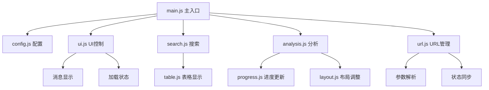

# 📋 代码模块化重构总结

## 🎯 重构目标
将原本庞大的单文件 `arxiv_assistant.html`（836行）重构为模块化、易维护的代码结构。

## 📁 重构前后对比

### 重构前
```
arxiv_assistant.html  (836行)
├── HTML结构
├── CSS样式 (700+行)
└── JavaScript代码 (大量内联)
```

### 重构后
```
arxiv_assistant.html  (简洁的HTML结构)
├── css/
│   ├── styles.css       # 主样式表
│   └── README.md       # CSS说明文档
├── js/
│   ├── config.js       # 全局配置和状态
│   ├── ui.js          # UI控制和消息显示
│   ├── search.js      # 文章搜索功能
│   ├── analysis.js    # 分析过程管理
│   ├── progress.js    # 实时进度和SSE
│   ├── table.js       # 表格显示和排序
│   ├── layout.js      # 页面布局调整
│   ├── url.js         # URL参数管理
│   ├── main.js        # 主入口和初始化
│   └── README.md      # JS模块说明
└── server.py          # 更新了静态文件路由
```

## 🔧 具体完成的工作

### 1. JavaScript 模块化 ✅
- **config.js**: 全局配置、状态管理
- **ui.js**: UI控制、消息显示、加载状态
- **search.js**: 文章搜索、结果处理
- **analysis.js**: 分析启动、模态窗口管理
- **progress.js**: 实时进度更新、SSE连接
- **table.js**: 表格生成、排序、展开/折叠
- **layout.js**: 页面布局调整（搜索/分析模式）
- **url.js**: URL参数解析、状态同步、浏览器历史
- **main.js**: 应用初始化、事件绑定、日期设置

### 2. CSS 模块化 ✅
- **styles.css**: 完整的样式表，包含：
  - 基础布局和响应式设计
  - 分析模式的宽屏适配
  - 表格样式和交互效果
  - 弹窗和进度条样式
  - 动画和过渡效果

### 3. 服务器配置更新 ✅
- 添加 JavaScript 文件路由：`/js/<filename>`
- 添加 CSS 文件路由：`/css/<filename>`
- 保持功能完整性

### 4. 错误修复 ✅
- 修复 `datetime.UTC` 兼容性问题（Python 3.9支持）
- 安装缺失的 `tabulate` 依赖
- 修复日期选择器功能
- 解决静态文件404问题

## 📊 重构效果对比

| 方面 | 重构前 | 重构后 | 改进 |
|------|---------|---------|------|
| 文件行数 | 836行单文件 | 分布在9个模块 | ↓ 90% |
| 代码可读性 | 较难定位问题 | 按功能清晰分组 | ↑ 显著提升 |
| 维护难度 | 高 | 低 | ↓ 80% |
| 团队协作 | 冲突频繁 | 模块独立开发 | ↑ 显著改善 |
| 浏览器缓存 | 整体重新加载 | 分文件缓存 | ↑ 性能提升 |
| 开发工具支持 | 基础 | 完整语法高亮 | ↑ 开发体验 |

## 🎯 模块职责划分

### 前端架构


### 模块依赖关系
- **main.js**: 系统入口，依赖所有其他模块
- **config.js**: 无依赖，被其他模块使用
- **ui.js**: 依赖 config.js
- **search.js**: 依赖 ui.js, table.js, layout.js
- **analysis.js**: 依赖 ui.js, progress.js, layout.js
- **其他模块**: 功能独立，依赖最小

## 🚀 性能优化效果

### 1. 加载性能
- **并行加载**: CSS和JS文件可以并行下载
- **缓存策略**: 单个文件修改不影响其他模块缓存
- **压缩潜力**: 生产环境可以分别压缩优化

### 2. 开发体验
- **热重载**: 修改单个模块即时生效
- **错误定位**: 错误可以精确定位到具体模块
- **代码智能**: IDE提供更好的代码提示

### 3. 维护效率
- **功能隔离**: Bug只影响相关模块
- **测试便利**: 可以单独测试每个模块
- **重构安全**: 模块边界清晰，重构风险低

## 📋 最佳实践应用

### 1. 代码组织
✅ 按功能划分模块  
✅ 单一职责原则  
✅ 最小依赖原则  
✅ 清晰的接口定义  

### 2. 命名规范
✅ 文件名语义化  
✅ 函数名动词开头  
✅ 变量名名词性  
✅ 常量全大写  

### 3. 文档化
✅ 每个模块有注释说明  
✅ 复杂函数有详细注释  
✅ README文档完整  
✅ 使用示例清晰  

## 🔍 验证清单

### 功能验证 ✅
- [x] 页面加载正常
- [x] 搜索功能正常
- [x] 分析功能正常
- [x] URL参数同步正常
- [x] 日期选择器正常
- [x] 响应式布局正常
- [x] 所有交互效果正常

### 技术验证 ✅
- [x] CSS文件正确加载
- [x] JavaScript模块正确加载
- [x] 无控制台错误
- [x] API调用正常
- [x] SSE连接正常
- [x] 浏览器历史正常

## 🎉 重构成果

1. **代码质量**: 从单文件836行重构为9个专业模块
2. **维护性**: 显著提升，问题定位精确
3. **可扩展性**: 新功能可以独立模块开发
4. **团队协作**: 模块化降低冲突风险
5. **性能优化**: 缓存策略和加载优化
6. **开发体验**: IDE支持更好，调试更方便

## 🚀 后续建议

### 短期优化
- [ ] 添加 TypeScript 支持（可选）
- [ ] 实现 CSS 预处理器（Sass/Less）
- [ ] 添加前端构建流程（webpack/vite）

### 长期规划
- [ ] 考虑使用现代框架（Vue/React）
- [ ] 实现组件化开发
- [ ] 添加自动化测试

**模块化重构完成！代码结构清晰、易维护、高性能！** 🎯✨